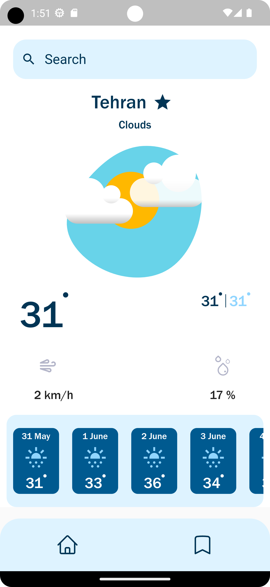
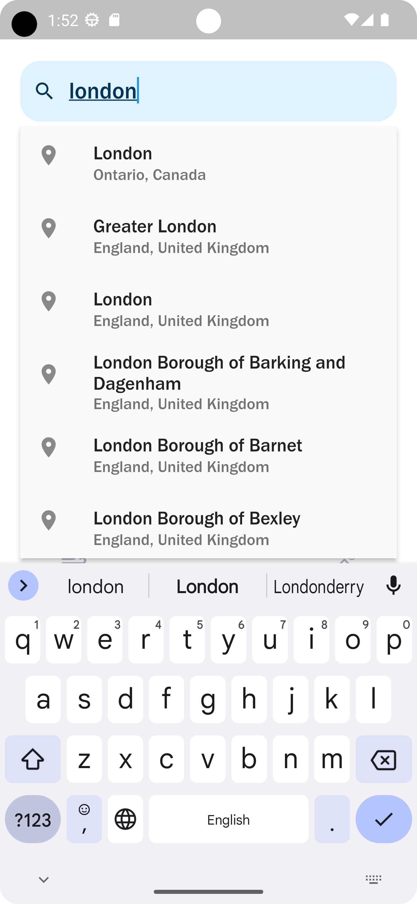
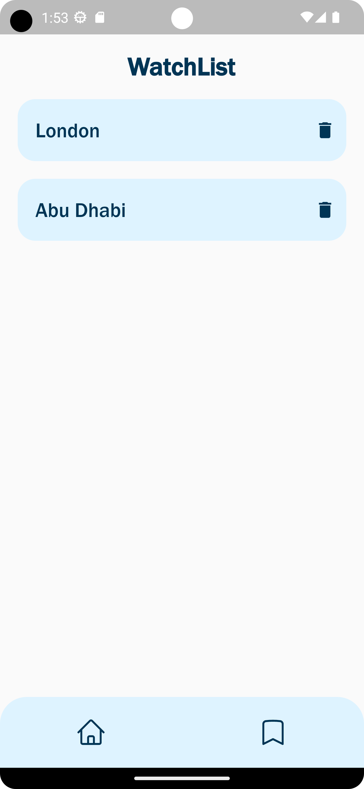

# Weather App

# 3rd Packages
    - dio:  Http Client
    - equatable : for test app 
    - bloc : for State Managment 
    - flutter_bloc : for State Managment 
    - get_it : for Dependecy injection
    - heroicons : for icons
    - font_awesome_flutter: for icons
    - flutter_spinkit: App's loading
    - flutter_svg: for use SVG (Scalable Vector Graphics)
    - flutter_typeahead: for search text field
    - floor : for DB
    - floor_generator : for DB
    - build_runner : provides a concrete way of generating files using Dart code

# Features
    - Splash: for user login
    - Weather:  for city weather information
    - Bookmark:  for view the saved cities

# Environments
    I used Android Studio
    Flutter 3.10.5 • channel stable 
    Dart 2.19.0

# How to run

    First, Android Studio -> AVD Manager -> run select device

    Second, VS Code termial: flutter run -d 'device_name'

# Images

    <table>
        <tr>
            <td style="text-align: center">
                    
            </td>            
            <td style="text-align: center">
                    
            </td>                     
        </tr>
        <tr>
            <td style="text-align: center">
                    
            </td>
        </tr>
    </table>

